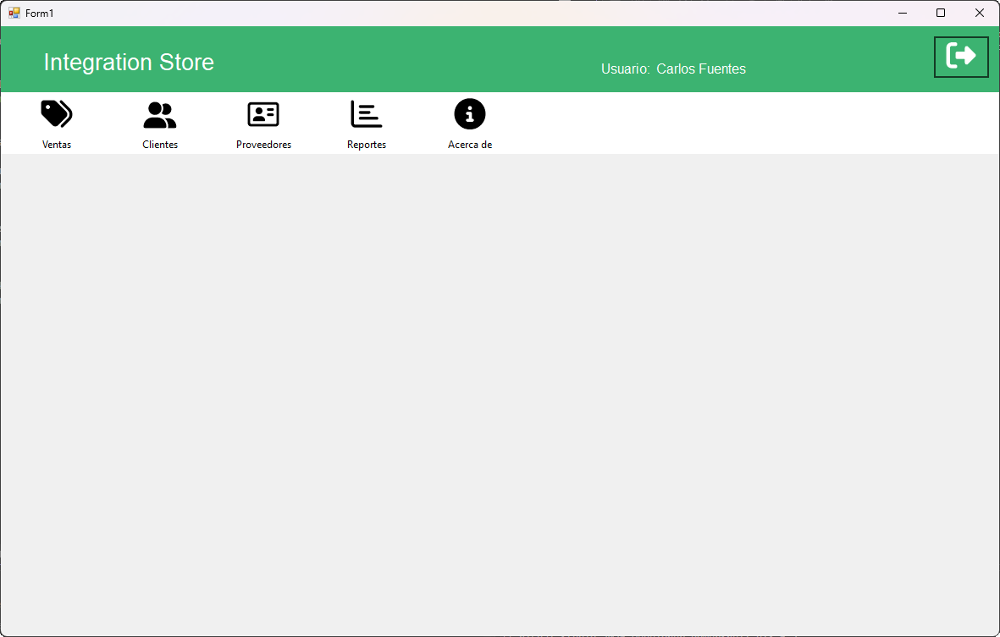

# Integration Store

Sistema de gestión de inventario, compras y ventas desarrollado en **C#**, **Windows Forms** y **SQL Server**, orientado a pequeñas y medianas empresas que requieren administrar productos, clientes, proveedores y transacciones comerciales desde una única plataforma.

---

## Descripción

Integration Store fue desarrollado como proyecto académico para la carrera de Analista Programador durante el año 2024.

La aplicación permite administrar productos, categorías, clientes, proveedores y transacciones comerciales desde una única plataforma.

Aunque las capturas de ejemplo utilizan una tienda informática, el sistema puede adaptarse fácilmente a distintos tipos de negocios mediante la configuración del negocio y la gestión personalizada de productos, categorías y proveedores.

---

## Características Principales

### Gestión de Usuarios

* Administración de usuarios.
* Control de acceso mediante roles.
* Activación y desactivación de cuentas.

### Gestión de Inventario

* Administración de categorías.
* Registro y actualización de productos.
* Control de stock.
* Gestión de precios de compra y venta.

### Gestión Comercial

* Registro de clientes.
* Registro de proveedores.
* Registro de compras.
* Registro de ventas.

### Reportes

* Reporte de compras.
* Reporte de ventas.
* Filtros por fecha.
* Exportación a Excel.

### Documentación

* Generación de comprobantes PDF para compras.
* Generación de comprobantes PDF para ventas.

### Integridad de Datos

* Restricción de eliminación de registros asociados a transacciones históricas.
* Actualización automática de stock después de compras y ventas.

---

## Tecnologías Utilizadas

* C#
* Windows Forms
* SQL Server
* ADO.NET
* Arquitectura Multicapa
* Exportación a Excel
* Generación de PDF

---

## Arquitectura del Proyecto

El sistema fue desarrollado utilizando una arquitectura multicapa:

```text
PresentationLayer
│
├── BusinessLayer
│
├── DataLayer
│
└── EntityLayer
```

### Capas

**PresentationLayer**

* Formularios Windows Forms.
* Interacción con el usuario.

**BusinessLayer**

* Reglas de negocio.
* Validaciones.

**DataLayer**

* Acceso a datos.
* Consultas SQL.

**EntityLayer**

* Entidades y modelos de datos.

---

## Base de Datos

Motor utilizado:

* SQL Server

Script de creación:

```text
DBSystemApp.sql
```

El script incluye la estructura principal de tablas, relaciones y datos necesarios para la ejecución del sistema.

---

## Módulos del Sistema

### Login

Permite el acceso al sistema mediante autenticación de usuarios registrados. El acceso se encuentra controlado por roles, permitiendo restringir funcionalidades según el perfil asignado.


### Menú Principal
Interfaz principal desde donde se accede a todos los módulos del sistema. El menú lateral permite navegar entre las distintas funcionalidades de administración, compras, ventas y reportes.


### Gestión de Usuarios
Permite crear, modificar, activar, desactivar y administrar usuarios del sistema, además de asignar roles y controlar los permisos de acceso.


### Control de Acceso por Roles
El sistema implementa control de acceso basado en roles para restringir funcionalidades según el perfil del usuario autenticado.

#### Administrador

Acceso completo a la administración de usuarios, categorías, productos, compras, ventas, clientes, proveedores, reportes y configuración del negocio.

#### Empleado

Acceso limitado a funciones operativas como ventas, clientes, proveedores y reportes, manteniendo protegidos los módulos administrativos.



### Gestión de Categorías
Permite administrar las categorías utilizadas para clasificar los productos del inventario, facilitando su organización y búsqueda.


### Gestión de Productos
Permite registrar productos, controlar stock, definir precios de compra y venta, asignar categorías y administrar la información comercial de cada artículo.


### Exportación Excel de Productos


### Configuración del Negocio
Permite personalizar la información de la empresa, incluyendo nombre comercial, razón social, RUT, dirección y logotipo.

Gracias a esta funcionalidad, el sistema puede adaptarse fácilmente a distintos tipos de negocios, como tiendas de informática, minimarkets, ferreterías, librerías, restaurantes o comercios de barrio.


### Registro de Ventas
Permite registrar ventas, seleccionar clientes, generar comprobantes y actualizar automáticamente el stock de los productos vendidos.


### Detalle de Venta
Visualización detallada de los productos vendidos, cantidades, precios y totales asociados a cada transacción.


### PDF de Venta
El sistema genera automáticamente comprobantes de venta en formato PDF para impresión o almacenamiento digital.


### Registro de Compras
Permite registrar compras realizadas a proveedores, actualizar inventario y mantener trazabilidad de las adquisiciones realizadas por la empresa.


### Detalle de Compra
Visualización detallada de los productos adquiridos, cantidades y costos asociados a cada compra.


### PDF de Compra
El sistema permite generar documentos PDF con el detalle completo de las compras registradas.


### Clientes
Permite registrar, modificar y administrar la información de clientes utilizados durante el proceso de ventas.


### Proveedores
Permite administrar proveedores y mantener un registro centralizado de las empresas o personas que abastecen productos al negocio.

El sistema protege la integridad de los datos impidiendo eliminar proveedores asociados a compras históricas.


### Reporte de Compras
Permite consultar compras realizadas mediante filtros por rango de fechas y generar información útil para la gestión administrativa.


### Exportación Excel de Compras
La información obtenida en los reportes puede exportarse a Excel para análisis o respaldo.


### Reporte de Ventas
Permite analizar las ventas realizadas mediante filtros por período, facilitando el seguimiento comercial del negocio.


### Exportación Excel de Ventas
Los resultados pueden exportarse a Excel para su posterior análisis o integración con otras herramientas.


### Acerca del Proyecto
Pantalla informativa que resume las funcionalidades principales, tecnologías utilizadas y propósito general de la aplicación.


---

## Instalación

### Requisitos

* Windows
* SQL Server
* Visual Studio

### Pasos

1. Restaurar la base de datos utilizando el script `DBSystemApp.sql`.
2. Configurar la cadena de conexión en `App.config`.
3. Abrir la solución `IntegrationStore_APP.sln`.
4. Compilar y ejecutar el proyecto.

---

## Credenciales Demo

Administrador:

Documento:

```text
178945-3
```

Contraseña:

```text
Admin2024
```

Empleado:

Documento:

```text
195874-8
```

Contraseña:

```text
Venta2024
```

---

## Estado del Proyecto

Proyecto finalizado y conservado como parte del portafolio personal para demostrar conocimientos en:

* Programación orientada a objetos.
* Desarrollo de aplicaciones de escritorio.
* SQL Server.
* Arquitectura multicapa.
* Gestión de inventario.
* Desarrollo de sistemas administrativos.

---

## Autor

Antonio Toro Sagredo

Analista Programador
